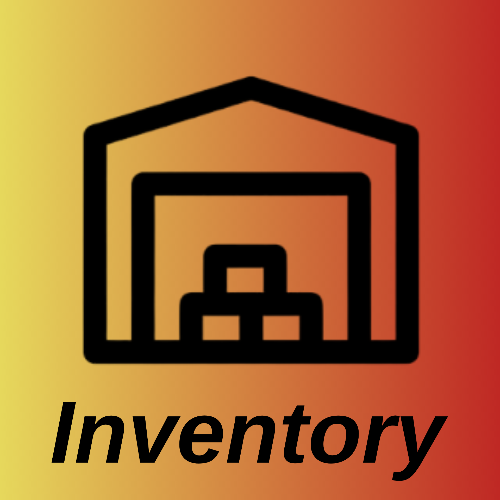

<p align="center">
  <a href="/"></a>
</p>

</p>
<p align="center" >
<a href="https://www.typescriptlang.org/" target="_blank">
  
</a>
<a href="https://www.postgresql.org/" target="_blank">
  
</a>
<a href="https://jwt.io/" target="_blank">
  
</a>
<a href="https://expressjs.com/" target="_blank">
  
</a>
<a href="https://axios-http.com/" target="_blank">
  
</a>
<a href="https://reactjs.org/" target="_blank">
  
</a>

## Descripción

La empresa FORMOTEX se dedica al mantenimiento y distribución de equipos
informáticos para diversas organizaciones. Actualmente, la empresa gestiona su inventario
de manera manual, lo que provoca errores en el seguimiento de los equipos, como la falta
de información actualizada sobre su estado, ubicación y fecha de adquisición.

## Instalación de librerias.

```bash
 npm install
```

## Configurar las variables de entorno necesarias.

```
DB_HOST=
DB_USER=
DB_PASS=
DB_NAME=
DB_PORT=
PORT=
JWT_SECRET_KEY=
```

#### NOTA: Crear una base de datos en Postgres que se llame "formotex_db"

## Iniciar la aplicación

```bash
npm run start

# En modo de desarrollo.
npm run dev
```

# Funcionalidades desarrolladas.

Para ver las funcionalidades desarrolladas, vease el archivo REQUEST.MD.
